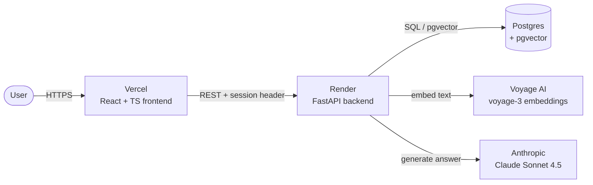

# office-hours

An AI study assistant that answers questions about your course material with citations to the exact source page. Powered by retrieval-augmented generation (RAG).

**🌐 [Live demo](https://office-hours-two.vercel.app)** · Pre-loaded with sample EH101 (history) lecture PDFs. First request after idle takes ~30s while the free-tier backend wakes up.

---

## What it does

Upload a PDF, ask questions about it, get answers grounded in the actual source — with clickable citations that show the original passage. Built as a portfolio project to explore production-quality RAG.

- **Cited answers** — every claim links to a specific document and page
- **Expandable source previews** — click a citation to see the exact passage the answer was drawn from
- **Multi-document search** — ask questions that span multiple uploaded PDFs
- **Honest refusal** — declines to answer when the provided material doesn't cover the question, instead of hallucinating
- **Per-visitor isolation** — your uploaded documents are private to your session; shared demo docs are visible to everyone

## Architecture



Two distinct pipelines share one database:

1. **Indexing** (one-time per document): PDF → header/footer stripped → paragraph-aware chunks → embedded with Voyage → stored in Postgres with HNSW index
2. **Querying** (every question): question → embedded → top-k cosine similarity search via pgvector → relevant chunks + question sent to Claude → cited answer returned

## Retrieval quality

Measured against a hand-curated eval set of 17 questions across two domain-specific lecture PDFs:

| Metric                     | Score |
| -------------------------- | ----- |
| Top-1 doc accuracy         | 100%  |
| Top-1 page accuracy        | 94.1% |
| Top-5 page accuracy        | 100%  |
| Mean Reciprocal Rank (MRR) | 0.971 |

The eval script (`eval.py`) is included so anyone can reproduce these numbers or extend the eval set.

## Tech stack

**Backend** — Python 3.12, FastAPI, psycopg, pgvector, pypdf, NumPy
**Database** — Postgres 16 with the pgvector extension (HNSW index for fast cosine similarity)
**AI services** — Anthropic Claude Sonnet 4.5 for answer generation, Voyage AI `voyage-3` for embeddings
**Frontend** — React 19, TypeScript, Vite, lucide-react, react-markdown
**Infrastructure** — Docker for local Postgres, Render for backend + cloud Postgres, Vercel for frontend

## Project structure

```
office-hours/
├── api.py              # FastAPI app: /documents, /ask, /upload
├── chunker.py          # PDF parsing + paragraph-aware chunking with header/footer stripping
├── embedder.py         # Voyage AI client with persistent local cache
├── retriever.py        # pgvector-backed top-k search, session-scoped
├── prompt.py           # Prompt construction + Claude call
├── db.py               # Postgres connection
├── ingest.py           # CLI script to index PDFs from docs/
├── eval.py             # Retrieval quality evaluation
├── schema.sql          # Database schema (idempotent)
├── eval_set.json       # 17 hand-curated test questions
├── Dockerfile          # Backend container for Render
├── docker-compose.yml  # Local Postgres + pgvector
└── web/                # React + Vite frontend
    └── src/
        ├── api.ts      # Typed API client
        └── App.tsx     # Single-page chat UI
```

## Running locally

**Prerequisites:** Python 3.12+, Node 20+, Docker, Anthropic + Voyage API keys.

```bash
# 1. Backend setup
cp .env.example .env                              # add your API keys
python -m venv venv && source venv/bin/activate
pip install -r requirements.txt

# 2. Start Postgres + apply schema
docker compose up -d
psql "$DATABASE_URL" -f schema.sql

# 3. Index any PDFs you place in docs/
python ingest.py

# 4. Start the backend
uvicorn api:app --reload

# 5. In another terminal, start the frontend
cd web
npm install
npm run dev
```

Open http://localhost:5173. Backend runs on http://localhost:8000 with interactive API docs at /docs.

## Engineering notes

A few decisions worth surfacing for anyone reading the code:

- **Chunking strategy** — paragraph-aware splitting with 50-word overlap between chunks, plus statistical detection of repeated header/footer lines (any line appearing on ≥50% of pages is stripped). This noticeably improves retrieval over naive word-count splits.
- **Embedding cache** — embeddings are content-addressed (SHA-256 of model + input_type + text) and cached locally, so re-runs during development are free and instant.
- **Multi-tenancy via session IDs** — visitors get a random UUID stored in localStorage and sent as `X-Session-Id` on every request. The database tags each document with the session that uploaded it; queries filter to public demo docs + the requesting session's docs. No login required, but data is isolated.
- **HNSW index** — `chunks` has a HNSW (graph-based approximate nearest neighbor) index on the embedding column with `vector_cosine_ops`. Keeps similarity search fast even as the chunk count grows.
- **Indexing and querying are separated** — `ingest.py` is a CLI for bulk indexing, the API only handles single uploads + queries. This separation matters because indexing is slow (chunking + embedding) and querying is fast (single similarity search).

## Future work

- **PDF viewing** — currently the original PDF isn't stored after indexing; citations link to a page number but can't open the source. Adding object storage (Cloudflare R2) and a `/documents/{id}/pdf` endpoint would enable click-to-read.
- **Streaming responses** — answers currently arrive all at once; streaming would feel faster.
- **Authentication** — session isolation is anonymous (UUID in localStorage). Real OAuth would enable cross-device access to a user's documents.
- **Reranking** — adding a cross-encoder reranker on top of vector retrieval would likely push top-1 accuracy from 94% to closer to 100%.
- **Cold start mitigation** — the free Render tier spins down after 15 min idle; a small cron ping or paid tier would eliminate the first-request delay.

## License

MIT.

---

Built by [@hVmelt](https://github.com/hVmelt).
